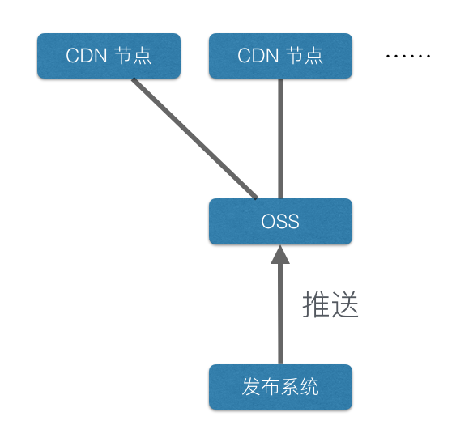

## 解决的问题

消除前端项目部署与业务量之间的关系

无论业务量增加多少倍，前端所需的硬件资源都是额定的

## 背景

很早以前 Web 开发是不区分前后端的，HTML 由服务器动态生成，项目部署只是服务器端的代码发布而已。
后来浏览器提供了越来越多的 API 支持，前端开发逐渐复杂起来。
于是诞生了专注于浏览器端程序开发的「前端」这个分支。

虽然现在前后端分离开发已经非常普遍，但是在很多古老的程序架构下，它们只是实现了开发人员的职责分离。
**这种前后端混部的模式会带来巨大的风险。**

  1. 后端发布的风险

  前端的变更往往是小而频繁的，也许只是修改一个文案或一个颜色。
  在前后端混部的情况下，这些变更都需要所有代码重新编译重新发布，发布过程的每个环节都是风险。
  比如编译过程中的某个依赖的版本错误，或者发布后重启服务导致本地缓存丢失，甚至是发布过程中网络抖动等。

  2. 服务器负载的风险

  有一类前端页面是属于纯展示性的，完全不涉及数据交互。
  而且出于营销等目的，它们的业务量会非常巨大，而且难以预估。
  这类页面带来的流量很可能是服务器无法接受的。

**真正的前后端分离是后端完全 API 化，前后端分别开发和部署，互不干扰。**
一个前端项目可能调用多套后端 API，一套后端 API 也可能提供给多个前端项目使用。

前后端完全分离后我们可以观察到，数据的变更不会导致前端的变更。
这意味着**前端更趋向于「资源型产出」，而不是后端那样的「运营型产出」**。
举例来说就是一个项目的业务量增加了 100 倍，后端开发人员可能要一直调整架构变更方案，而前端开发人员可以和设计师一样完全使用同一套东西。

既然前端可以是资源型产出，那么就可以和资源类部署结合起来。
**这就是 Clouding 这套方案**。

## 零机器

所谓的「零机器」并不是完全没有服务器，理论上必须要有服务器才能跑 http 服务。
这里的「零机器」是指没有任何与业务量相关的机器。

一般后端服务的机器数量与业务量是有关的，大多数程线性关系。
而资源类型的部署可以使用 CDN，对源站的压力只有 CDN 节点乘以资源量而已，这些都是常量。

## 部署原理

**Clouding** 方案的核心其实就是把前端项目完全部署在 CDN 上。

由于 CDN 总是需要一个中心数据源，所以这个过程需要一个源服务器（下图中的 OSS）。

OSS 可以是第三方的服务，也可以是自建的。

整个工作流畅大概有这么几个步骤：

1. 发布系统将代码推送到 OSS
2. 调用 CDN 的 API 清缓存
3. 由于缓存被清空，CDN 被请求后回到 OSS 取资源

有些云服务提供商同时提供了 OSS 和 CDN 服务，并且提供了 OSS 到 CDN 的自动同步功能。
如果使用这种方式我们要做的只是将代码发布到 OSS，其它事情全交给云提供方的程序搞定。

## 缓存设置

**Clouding** 方案中最关键的参数配置就是缓存时间了。
我们不仅要关心资源在客户端缓存多久，还得关心资源在 CDN 节点缓存多久。
这可以在响应的 Cache-Control 中分别使用 max-age 和 s-maxage 来配置。
由于 **Clouding** 的数据流向是主动的，我们主动调用 CDN 的 API 来清缓存，所以 CDN 到 源站的缓存可以设非常大。
也就是 s-maxage 的取值非常大，可以设置个一年之类的时间。

至于客户端要缓存多久那就得看业务需求了。
如果前端项目构建时会自动给资源文件加版本号，那么我们可以针对 html 文件关闭缓存，对其它类型的资源文件开启一个非常大的缓存。
或者最坏的情况是完全关闭客户端缓存，让所有请求打到 CDN 节点。即便是这样也只是多出点流量而已，对源站并没有额外的压力。

## 前端项目改造

**Clouding** 方案的难点并不是在部署上，而是对于前端项目的改造。

并不是任何前端项目都可以直接使用这套方案。
这套方案有许多局限性，在使用时前端项目可能是需要改造的。
下面我们逐个介绍。

  1. URL 路由

  CDN 本身是为静态资源设计的，而静态资源 http 服务器通常被设计成 URL 与磁盘文件直接对应。
  所以前端项目也只能使用此种方式来访问资源。

  自从前端有了 <a href="https://developer.mozilla.org/en-US/docs/Web/API/History">History API</a> 后，在前端圈有个非常普遍的做法。
  让服务器将所有请求都指向同一个 html 文件，由前端自己处理路由并展示。
  这种做法到 **Clouding** 上就不再适用了，或者即便有一些黑科技可以实现但也不建议使用。

  前端业务如果希望自己维护 URL 与展示逻辑可以选择 QueryString 和 hash。而 QueryString 可能造成 http 无法 cache，所以这里推荐的方案是使用 hash。

  2. 跨域 API 调用
  
  即便是前后端分离，一些前端项目依然会通过服务器代理来调用后端 API 以解决跨域问题。
  如果前端项目完全在 CDN 上，CDN 是无法帮你代理调用 API 的。
  或者即便通过 CDN 从源站调用 API，这也会导致源站的负载变得与业务有关，违背了我们的理念。
  所以 **Clouding** 方案中的前端项目需要完全跨域调用 API。
  至于如何跨域，这就得根据自己的项目需求来考虑了。
  现代浏览器对 CORS 的支持是不错的，大部分使用可以满足业务需求。
  如果实在是要考虑低版本 IE 的话建议使用 jsonp。
